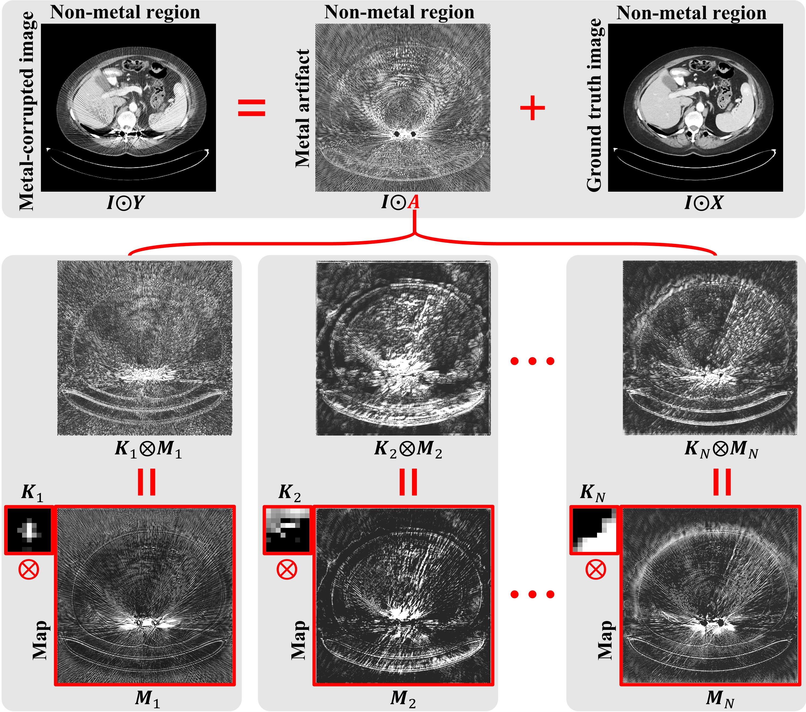
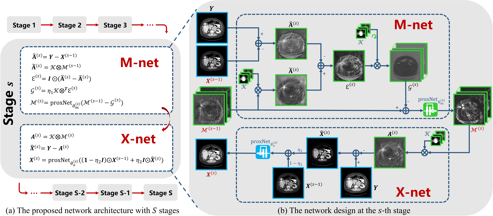
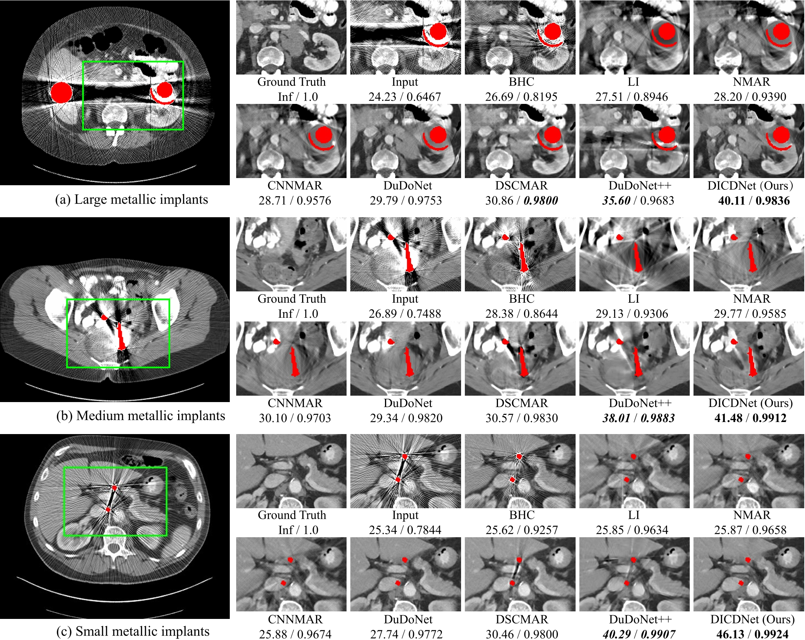
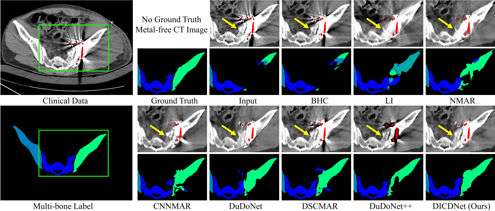

# DICDNet: Deep Interpretable Convolutional Dictionary Network for Metal Artifact Reduction in CT Images (TMI2021)
[Hong Wang](https://hongwang01.github.io/), Yuexiang Li, Nanjun He, Kai Ma, [Deyu Meng](http://gr.xjtu.edu.cn/web/dymeng), [Yefeng Zheng](https://sites.google.com/site/yefengzheng/)

DICDNet [[Google Drive]](https://drive.google.com/file/d/1FwWqtXIBD3dAL563oLnjf2bX9nLtFkux/view?usp=sharing)

DICDNet_supp.pdf, [[Google Drive]](https://drive.google.com/file/d/1IprOzUse-L1bJV1UjcJPB2QeceCwirPD/view?usp=sharing)
[[Baidu NetDisk]](https://cowtransfer.com/s/7f38c2a44c754c)   password：h8yvdu  

## Abstract
 Computed tomography (CT) images are often impaired by unfavorable artifacts caused by metallic implants within patients, which would adversely affect the subsequent clinical diagnosis and treatment. Although the existing deep-learning-based approaches have achieved promising success on metal artifact reduction (MAR) for CT images, most of them treated the task as a general image restoration problem and utilized off-the-shelf network modules for image quality enhancement. Hence, such frameworks always suffer from lack of sufficient model interpretability for the specific task. Besides, the existing MAR techniques largely neglect the intrinsic prior knowledge underlying {\textcolor{black}{metal-corrupted CT images}} which is beneficial for the MAR performance improvement. In this paper, we specifically propose a deep interpretable convolutional dictionary network (DICDNet) for the MAR task. Particularly, we first explore that the metal artifacts always present non-local streaking and star-shape patterns in CT images. Based on such observations, a convolutional dictionary model is deployed to encode the metal artifacts. To solve the model, we propose a novel optimization algorithm based on the proximal gradient technique. With only simple operators, the iterative steps of the proposed algorithm can be easily unfolded into corresponding network modules with specific physical meanings. Comprehensive experiments on synthesized and clinical datasets substantiate the effectiveness of the proposed DICDNet as well as its superior interpretability, compared to current state-of-the-art MAR methods.

## Dependicies

This repository is tested under the following system settings:

Python 3.6

Pytorch 1.4.0

CUDA 10.1

GPU NVIDIA Tesla V100-SMX2


## Model Formulation for MAR
<div  align="center"></div>


## Overview of DICDNet
The proposed DICDNet is naturally built by unfolding the corresponding optimization algorithm.
<div  align="center"></div>

## Benchmark Dataset

Please refer to [InDuDoNet](https://github.com/hongwang01/InDuDoNet) and [SynDeepLesion](https://github.com/hongwang01/SynDeepLesion)


## Training
```
python train_DICDNet.py --gpu_id 0  --data_path "data/train/" --batchSize 1 --batchnum 1 --log_dir "logs/" --model_dir "models/"
```
*Please note that for the demo, “batchnum=1, batchSize=1". Please change it according to your own training set.*

## Testing
```
python3 test_DICDNet.py  --gpu_id 0 --data_path "data/test/" --model_dir "pretrain_model/DICDNet_latest.pt" --save_path "save_results/"
```

## Metric
[PSNR/SSIM](https://github.com/hongwang01/RCDNet/tree/master/Performance_evaluation)


## Experiments on Synthesized DeepLesion
<div  align="center"></div>

## Experiments on Clinical Data
<div  align="center"></div>


## Citations

```
@article{wang2021dicdnet,
  title={DICDNet: Deep Interpretable Convolutional Dictionary Network for Metal Artifact Reduction in CT Images},
  author={Wang, Hong and Li, Yuexiang and He, Nanjun and Ma, Kai and Meng, Deyu and Zheng, Yefeng},
  journal={IEEE Transactions on Medical Imaging},
  volume={41},
  number={4},
  pages={869--880},
  year={2021},
  publisher={IEEE}
}
```
## References

[1] Hong Wang, Yuexiang Li, Haimiao Zhang, Jiawei Chen, Kai Ma, Deyu Meng, and Yefeng Zheng. InDuDoNet: An interpretable dual domain network for CT metal artifact reduction. In International Conference on Medical Image Computing and ComputerAssisted Intervention, pages 107–118, 2021.

[2] Hong Wang, Yuexiang Li, Haimiao Zhang, Deyu Meng, and Yefeng Zheng. InDuDoNet+: A Deep Unfolding Dual Domain Network for Metal Artifact Reduction in CT Images. Medical Image Analysis, 2022.

## Contact
If you have any question, please feel free to concat Hong Wang (Email: hongwang9209@hotmail.com)
